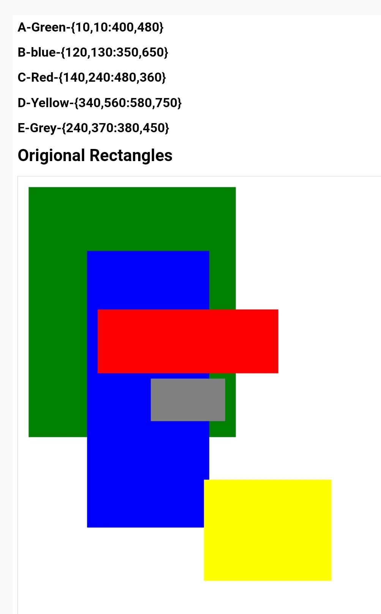
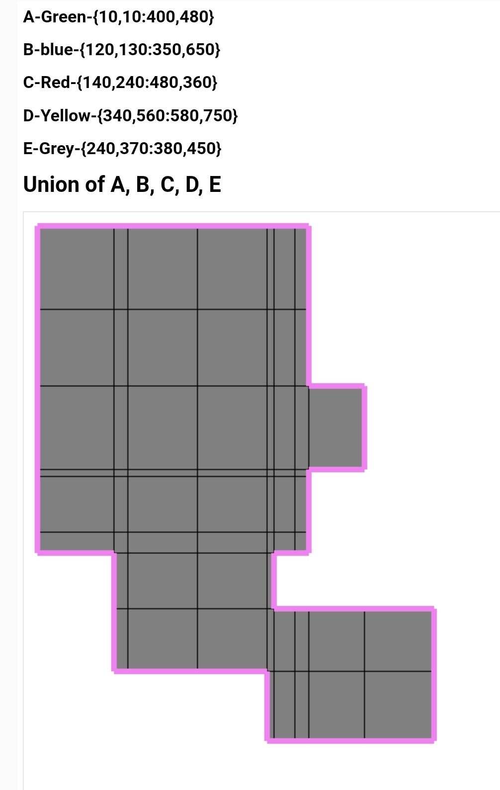
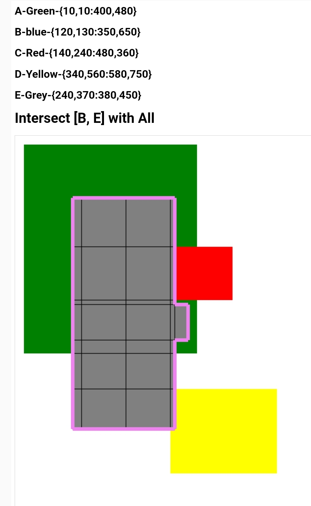
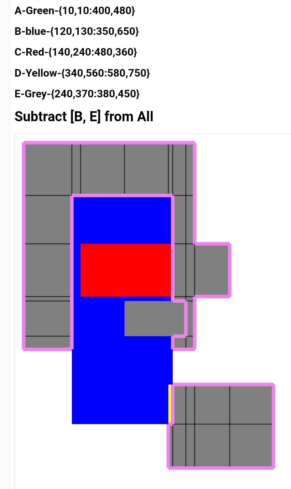

# JS-RECTSLIB
This class help for the logical constructions of the rectangles.
The groups of rectangles can be conbined using logical ooerations such as union, subtract and intersect.

## Algorythm
Algorythm is very simple.
- A region on which contains all the rectangles is divided into several rectangles according to the corners of the rectangles.
- Remove the rectangles above which does not lie inside all rectangles. This step gives the non-overlapped union of the rectangles.
- Then choose or remove the rectangles which lies inside the subject rectangles according to boolean operation intersect or subtract.

## Example Demo
````
````

## Check with Images
### Original Rectangkes


### Meshing and get union of rectangles


### Intersection of all with 2 rectangles


### Subtract of 2 from all


## Contact
Contact me for comercial use via mail winaungcho@gmail.com.

